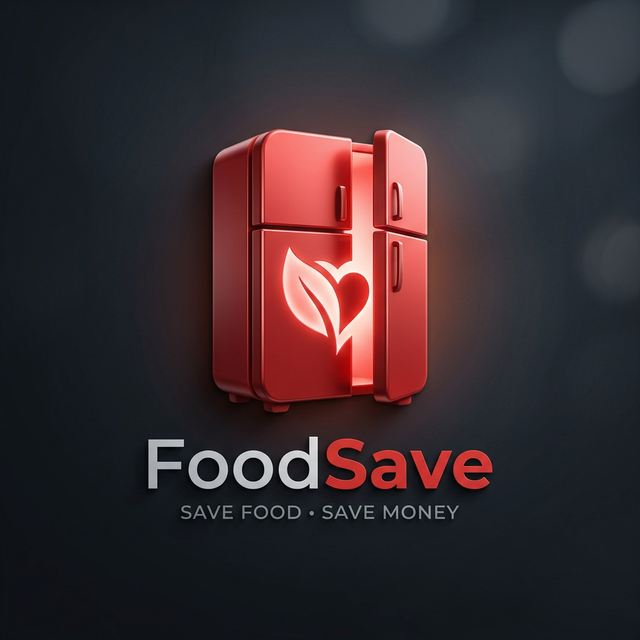

# 🍎 FoodSave - Спасай еду, Экономь деньги



**FoodSave** — это современное приложение для контроля за холодильником, помогающее бороться с пищевыми отходами и экономить ваши деньги. С помощью AI и удобного интерфейса приложение отслеживает продукты, предупреждает о истекающих сроках и подсказывает, что приготовить из имеющихся ингредиентов.

---

## 🏗️ Основные Функции

*   📸 **Умное Сканирование:** Фотографируйте чеки — приложение автоматически распознает товары (через OCR на backend) и добавит их в ваш инвентарь.
*   🧊 **Цифровая Копия Холодильника:** Список всех ваших продуктов с индикацией свежести в реальном времени.
*   🤖 **AI Рекомендации:** Рецепты подбираются на основе совпадений с продуктами в холодильнике; полноценная AI-модель подключается в следующих итерациях.
*   💬 **Поддержка 24/7:** Встроенный чат техподдержки на WebSockets для мгновенного решения любых вопросов.
*   📈 **Статистика Сбережений:** Трекинг спасенной еды и сэкономленного бюджета.

---

## 🛠️ Технологический Стек

### Frontend (Flutter)
*   **Architecture:** Feature-First (Senior Level Architecture)
*   **State Management:** Flutter Riverpod
*   **Routing:** AutoRoute
*   **Network:** Dio + Shared Preferences
*   **Realtime:** WebSockets

### Backend (Django)
*   **Framework:** Django REST Framework (DRF)
*   **Realtime Core:** Django Channels (ASGI)
*   **Auth:** JWT Authentication
*   **Processing:** Mock OCR Pipeline for Receipts

---

## 📁 Архитектура Приложения (Frontend)

Приложение спроектировано по принципу **Senior Feature-First Architecture** для обеспечения максимальной масштабируемости:

```
lib/
 ├── core/              # Глобальные темы, сервисы, роутер и виджеты
 └── features/          # Модули (фичи) приложения
      ├── auth/         # Вход и Регистрация
      ├── fridge/       # Управление продуктами + Сканер
      ├── recipes/      # AI Генерация рецептов
      ├── home/         # Главный экран
      └── support/      # Чат поддержки
```

---

## 🚀 Как запустить проект

### 1. Backend (Django)
```bash
cd food_save_backend
pip install -r requirements.txt
python manage.py migrate
python manage.py runserver 0.0.0.0:8000
```

### 2. Frontend (Flutter)
```bash
cd food_save
flutter pub get
flutter pub run build_runner build --delete-conflicting-outputs
flutter run
```

---

## 🏙️ Дизайн и Стилистика
Приложение выполнено в премиальном **Red UI** стиле:
*   **Primary Color:** #E53935 (Vibrant Red)
*   **Accents:** Тонкие градиенты, блюр-эффекты (Glassmorphism) и микро-анимации.
*   **UX:** Максимально простая и плавная навигация.

---

**Разработано с заботой об экологии и вашем бюджете. 🌿🥦**
